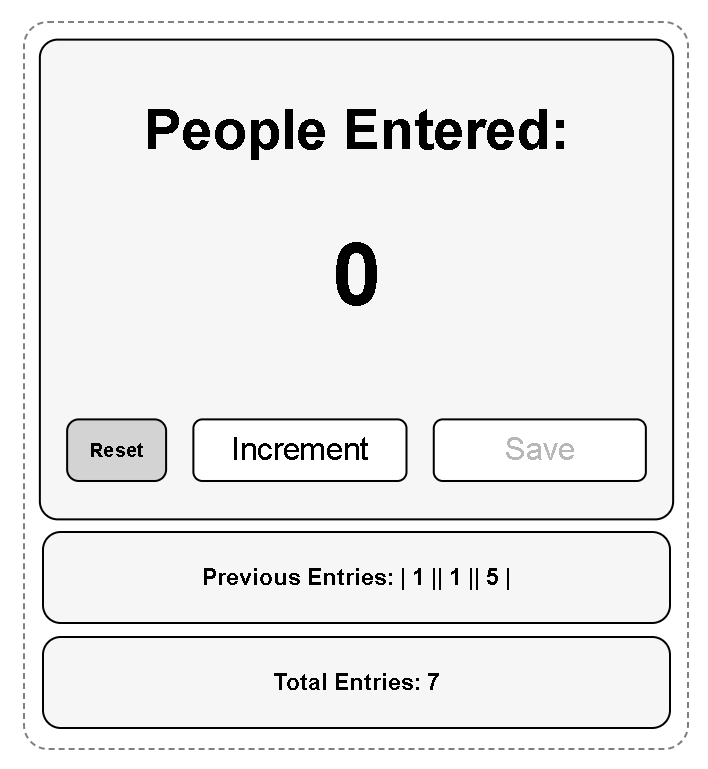

# People Counter 🚶‍♂️

A simple **People Counter Web App** built using **HTML, CSS, and JavaScript**.
The application tracks how many people enter a place, allows saving entries, and keeps a running total.

This project is part of my **#100DaysOfCode** journey while learning **Full Stack AI Web Development**.

---

## 🚀 Features

* Increment people count
* Save previous entries
* Calculate total entries automatically
* Reset the entire counter
* Simple and responsive UI
* Hover animations for interactive buttons

---

## 🛠️ Technologies Used

* **HTML5** – Page structure
* **CSS3** – Styling, layout, hover effects
* **JavaScript (Vanilla JS)** – Counter logic and DOM manipulation

---

## 🧠 JavaScript Concepts Used

This project demonstrates several core JavaScript techniques:

* **DOM Manipulation**
  Using `document.getElementById()` to access and update elements on the page.

* **Event Handling**
  Buttons trigger JavaScript functions through `onclick`.

* **Variables and State Management**
  Variables like `count`, `saved`, and `sum` store and manage application data.

* **Functions**
  Functions such as `increment()`, `save()`, `TotalEntries()`, and `reset()` organize the program logic.

* **Updating the UI Dynamically**
  Using `textContent` to update numbers and entries in real time.

* **Button State Control**
  The **Save button** is enabled and disabled using
  `saveBtn.disabled = true/false`.

* **String Concatenation**
  Previous entries are stored and displayed using text concatenation.

---

## 📷 Project Preview

---

## 💻 How It Works

1. **Increment** increases the number of people.
2. **Save** records the current number into Previous Entries.
3. The value is added to **Total Entries**.
4. **Reset** clears all stored data and restarts the counter.

---

## 🌐 Connect With Me

**LinkedIn**
👉 https://www.linkedin.com/in/fakhar-e-alam-a046133

**Scrimba (Where I’m Learning Full Stack AI Web Development)**
👉 https://scrimba.com/?via=u43a7734

---

## 📚 Learning Journey

This project is part of my **#100DaysOfCode** challenge where I build small projects daily to improve my **JavaScript and web development skills**.

---

⭐ If you like this project, feel free to **star the repository**.
